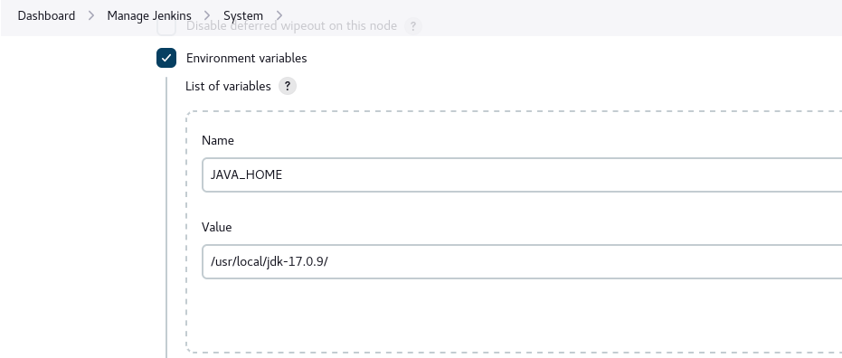

# Jenkins 流水线学习

## 一、Jenkins 安装部署

#### 1.1 Jenkins(2.426.2) 安装

```shell
# 下载镜像
docker pull jenkins/jenkins:lts-jdk17

# 创建数据目录
mkdir -pv /data/apps/jenkins

# 启动容器
docker run -itd --name jenkins \
-p 8080:8080 -p 50000:50000 \
--privileged=true \
-e TZ="Asia/Shanghai" \
-v /etc/localtime:/etc/localtime \
-v /var/run/docker.sock:/var/run/docker.sock \
-v /data/apps/jenkins:/var/jenkins_home \
docker pull jenkins/jenkins:lts-jdk17
```

## 二、Jenkinsfile语法

#### 2.1 基本案例

```groovy
pipeline {
  // 指定运行此流水线的节点
  agent { node { label "build" }}

  // 管道运行选项
  options {
    skipStagesAfterUnstable()
  }

  // 流水线节点
  stages {
    stage("Checkout") {
      steps{
        script{
          println("获取代码")
        }
      }
    }
    stage("Build") {
      steps{
        script{
          println("运行构建")
        }
      }
    }
  }
  post {
    always{
      script{
        println("流水线结束后，经常做的事情")
      }
    }
    success{
      script{
        println("流水线正常执行后，要做的事情")
      }
    }
    failure{
      script{
        println("流水线失败后，要做的事情")
      }
    }
    aborted{
      script{
        println("流水线取消后，要做的事情")
      }
    }
  }
}
```

#### 2.2 核心语法

###### 2.2.1 agent代理

agent 指定流水线要执行的节点

- any 在任何可用的节点上执行pipeline。none 没有指定agent的时候默认 
- label 在指定标签上的节点上运行Pipeline。 node 允许额外的选项(自定义workspace)

```groovy
agent any

agent { node { label 'labelname' }}

aget { label ' labelname '}
```

###### 2.2.2 post运行后处理 

当流水线完成后根据完成的状态做一些任务。例如：构建失败后邮件通知 

- always 无论流水线或者阶段的完成状态
- changed 只有当流水线或者阶段完成状态与之前不同时
- failure 只有当流水线或者阶段状态为"failure"运行
- success 只有当流水线或者阶段状态为"success"运行
- unstable 只有当流水线或者阶段状态为"unstable"运行。例如：测试失败

- aborted 只有当流水线或者阶段状态为"aborted “运行。例如：手动取消

```groovy
post { 
    always { 
        echo 'I will always say Hello again!'
    }

    failure{
        email : xxxx@dxx.com
    }
}
```

###### 2.2.3 stages阶段

stages 是流水线的整个运行阶段，包含一个或者多个stage，建议stages至少包含一个stage

```groovy
stages { 
    stage('Example') {
        steps {
            echo 'Hello World'
        }
    }
}
```

###### 2.2.4 environment环境变量

定义流水线环境变量，可以定义在全局变量或者步骤中的局部变量。这取决于 environment 指令在流水线内的位置 

```groovy
pipeline {
    agent any

    //全局变量
    environment { 
        activeEnv = 'dev'
    }
    stages {
        stage('Example') {

            //局部变量
            environment { 
                AN_ACCESS_KEY = credentials('my-prefined-secret-text') 
            }
            steps {
                sh 'printenv'
            }
        }
    }
}
```

###### 2.2.5 options运行选项

定义流水线运行时的配置选项，流水线提供了许多选项, 比如buildDiscarder,但也可以由插件提供, 比如 timestamps 

- buildDiscarder: 为最近的流水线运行的特定数量保存组件和控制台输出
- disableConcurrentBuilds: 不允许同时执行流水线。 可被用来防止同时访问共享资源等
- overrideIndexTriggers: 允许覆盖分支索引触发器的默认处理
- skipDefaultCheckout: 在agent 指令中，跳过从源代码控制中检出代码的默认情况
- skipStagesAfterUnstable: 一旦构建状态变得UNSTABLE，跳过该阶段
- checkoutToSubdirectory: 在工作空间的子目录中自动地执行源代码控制检出
- timeout: 设置流水线运行的超时时间, 在此之后，Jenkins将中止流水线
- retry: 在失败时, 重新尝试整个流水线的指定次数
- timestamps 预测所有由流水线生成的控制台输出，与该流水线发出的时间一致。

```groovy
pipeline {
    agent any
    options {
    timeout(time: 1, unit: 'HOURS') 
    }
}
```

###### 2.2.6 parameters参数 

为流水线运行时设置项目相关的参数，就不用在UI界面上定义了，比较方便

```groovy
//string 字符串类型的参数, 例如:
parameters { string(name: 'DEPLOY_ENV', defaultValue: 'staging', description: '') }

//booleanParam 布尔参数, 例如:
parameters { booleanParam(name: 'DEBUG_BUILD', defaultValue: true, description: '') }
```

###### 2.2.7 trigger触发器

```groovy
pipeline {
    agent any
    triggers {
        cron('H */4 * * 1-5')
    }
    stages {
        stage('Example') {
            steps {
                echo 'Hello World'
            }
        }
    }
}
```

###### 2.2.8 tool构建工具 

构建工具maven、ant、gradle,获取通过自动安装或手动放置工具的环境变量。支持maven/jdk/gradle。工具的名称必须在系统设置->全局工具配置中定义。

-  在全局配置中设置环境变量 JAVA_HOME

  

- 在全局工具配置中定义工具名称

  

```
pipeline {
    agent { node { label "build" }}
    tools {
        maven 'apache-maven-3.9.5' 
    }
    stages {
        stage('Example') {
            steps {
                sh 'mvn --version'
            }
        }
    }
}
```

###### 2.2.9 input交互输入

input用户在执行各个阶段的时候，由人工确认是否继续进行

- message 呈现给用户的提示信息。
- id 可选，默认为stage名称。
- ok 默认表单上的ok文本。
- submitter 可选的,以逗号分隔的用户列表或允许提交的外部组名。默认允许任何用户。
- submitterParameter 环境变量的可选名称。如果存在，用submitter 名称设置。
- parameters 提示提交者提供的一个可选的参数列表。

```groovy
pipeline {
    agent any
    stages {
        stage('Example') {
            input {
                message "Should we continue?"
                ok "Yes, we should."
                submitter "alice,bob"
                parameters {
                    string(name: 'PERSON', defaultValue: 'Mr Jenkins', description: 'Who should I say hello to?')
                }
            }
            steps {
                echo "Hello, ${PERSON}, nice to meet you."
            }
        }
    }
}
```

###### 2.2.10 when条件判断

when 指令允许流水线根据给定的条件决定是否应该执行阶段。 when 指令必须包含至少一个条件。

```groovy
//branch: 当正在构建的分支与模式给定的分支匹配时，执行这个阶段,这只适用于多分支流水线例如:
when { branch 'master' }


//environment: 当指定的环境变量是给定的值时，执行这个步骤,例如:
when { environment name: 'DEPLOY_TO', value: 'production' }

//expression 当指定的Groovy表达式评估为true时，执行这个阶段, 例如:
when { expression { return params.DEBUG_BUILD } }

//not 当嵌套条件是错误时，执行这个阶段,必须包含一个条件，例如:
when { not { branch 'master' } }

//allOf 当所有的嵌套条件都正确时，执行这个阶段,必须包含至少一个条件，例如:
when { allOf { branch 'master'; environment name: 'DEPLOY_TO', value: 'production' } }

//anyOf 当至少有一个嵌套条件为真时，执行这个阶段,必须包含至少一个条件，例如:
when { anyOf { branch 'master'; branch 'staging' } }


stage('Example Deploy') {
    when {
        branch 'production'
        environment name: 'DEPLOY_TO', value: 'production'
    }
    steps {
        echo 'Deploying'
    }
}
```

###### 2.2.11 parallel并行

声明式流水线的阶段可以在他们内部声明多隔嵌套阶段, 它们将并行执行。 注意，一个阶段必须只有一个 steps 或 parallel的阶段。 嵌套阶段本身不能包含 进一步的 parallel 阶段, 但是其他的阶段的行为与任何其他 stageparallel 的阶段不能包含 agent 或 tools阶段, 因为他们没有相关 steps。 

> failFast true 当其中一个进程失败时，强制所有的 parallel 阶段都被终止。 

```groovy
stage('Parallel Stage') {
    when {
        branch 'master'
    }
    failFast true
    parallel {
        stage('Branch A') {
            agent {
                label "for-branch-a"
            }
            steps {
                echo "On Branch A"
            }
        }
        stage('Branch B') {
            agent {
                label "for-branch-b"
            }
            steps {
                echo "On Branch B"
            }
        }
    }
}
```

###### 2.2.12 script脚本标签

可以通过此标签嵌入脚本式语法

```groovy
stage("Build"){
    steps{
        script{
            println("运行构建")
        }
    }
}
```
